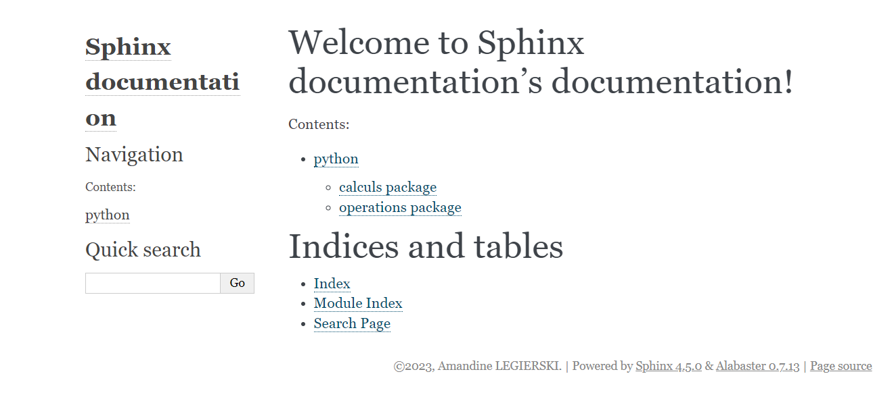
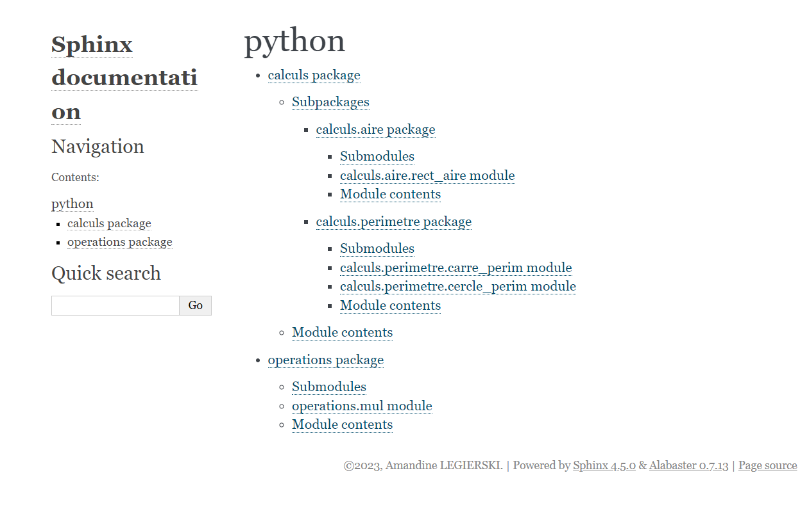
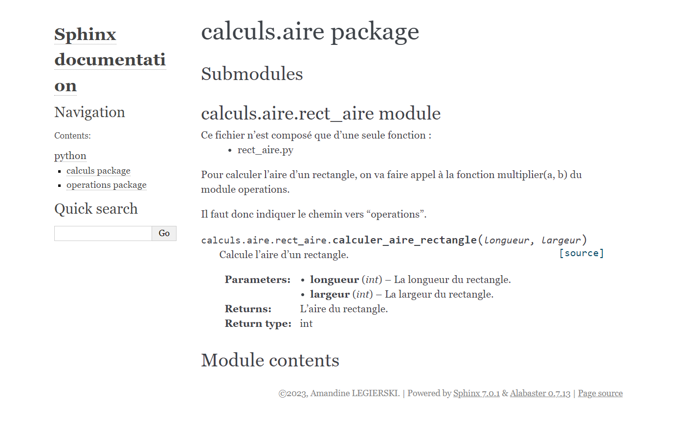

11. Mise à jour du dépôt GitHub
===============================

Pour **mettre à jour votre dépôt GitHub avec la documentation générée**, 
vous pouvez suivre les étapes suivantes :

Placez-vous à la racine de votre projet.

Utilisez la commande ``git add .`` pour ajouter tous les fichiers modifiés 
au suivi de version.

.. code-block:: console

    $ git add .

Exécutez la commande ``git commit -m "Nom personnalisé du commit"`` 
pour créer un nouveau commit avec un message de commit personnalisé.

.. code-block:: console

	$ git commit -m "Nom personnalisé du commit"

Remplacez "Nom personnalisé du commit" par un message significatif décrivant 
les modifications apportées à la documentation.

Enfin, utilisez la commande ``git push`` pour pousser les modifications vers 
votre dépôt GitHub.

.. code-block:: console

    $ git push

Maintenant, votre dépôt GitHub contient la dernière version de la documentation 
générée par Sphinx.

A ce stade de la notice, pour visualiser la documentation en ligne, vous pouvez 
**télécharger le fichier au format .zip à partir du dépôt GitHub**, puis le **décompresser 
sur votre ordinateur localement**. 

Vous pourrez ensuite ouvrir les fichiers ``html`` dans 
votre navigateur pour visualiser la documentation.

Le thème de la documentation générée est celui par défaut. 

Voici les résultats obtenus : 

    Page d'accueil de la documentation générée

    Sommaire de la documentation générée
    

    Exemple de documentation d'une fonction

.. tip:: 
    
    Si vous souhaitez héberger la documentation **en ligne de manière automatique**, 
    vous pouvez explorer des options telles que **GitHub Pages** *(cf section14)*. 
    
    Cela vous permettra de rendre la documentation accessible en ligne sans avoir 
    besoin de télécharger le fichier .zip à chaque fois.

