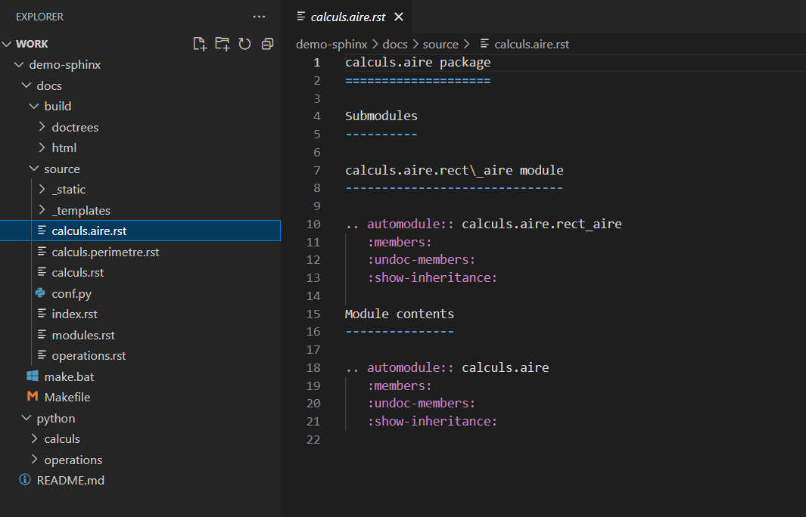
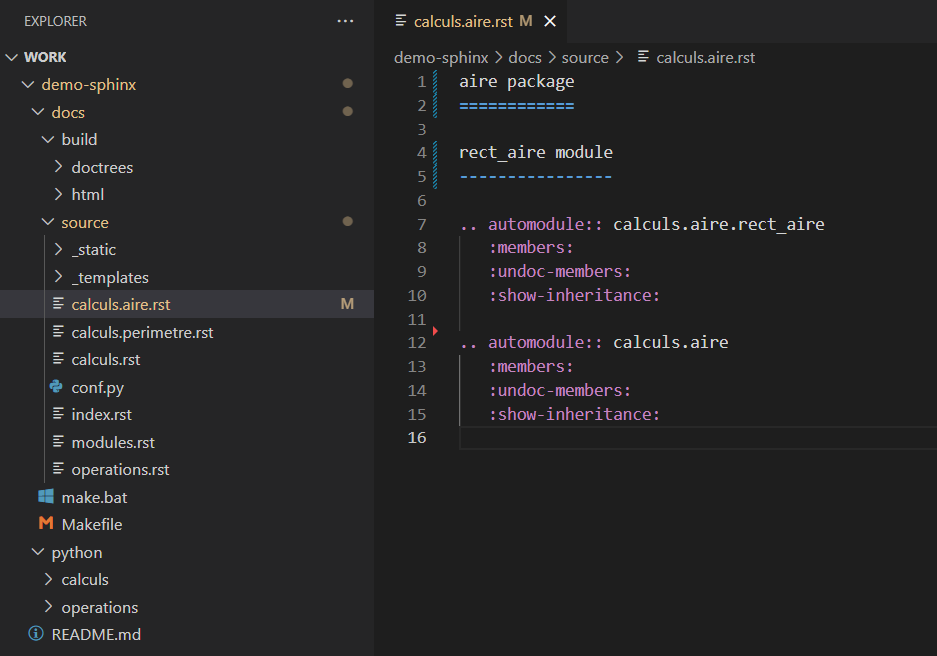
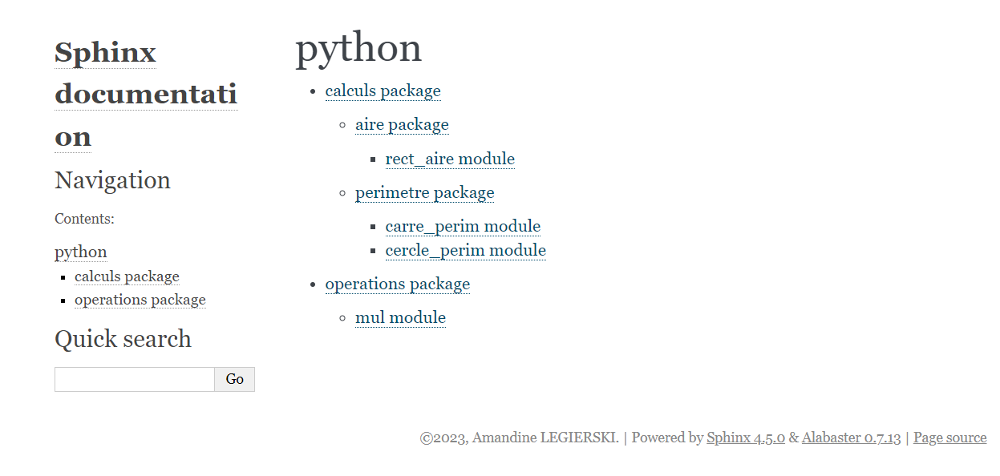

12. Embellissement des titres
=============================

Pour obtenir un **sommaire plus concis et esthétiquement agréable**, 
vous pouvez effectuer des **modifications manuelles dans les fichiers .rst correspondant**.

Prenons l'exemple, du fichier ``calculs.aire.rst``.

    Sans modification

    Avec modification

Et voici le résultat obtenu :

    Sommaire obtenu après modification manuelle

.. attention::
    
    N'oubliez pas de générer à nouveau la documentation après avoir effectué les modifications 
    en faisant ``make html`` pour voir les changements appliqués à votre documentation finale.

