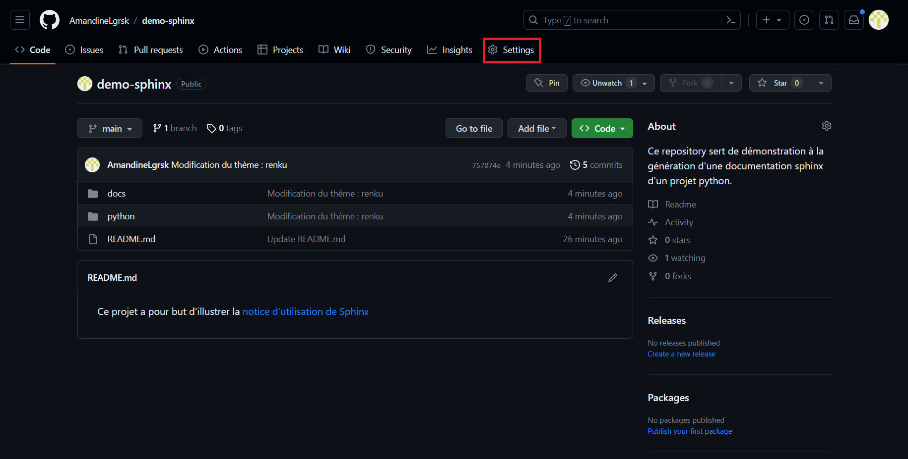
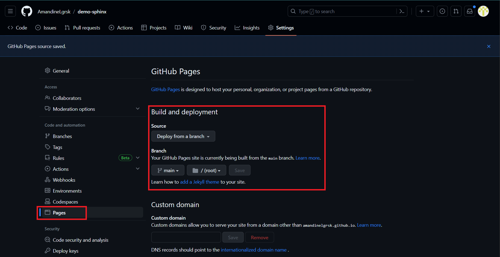
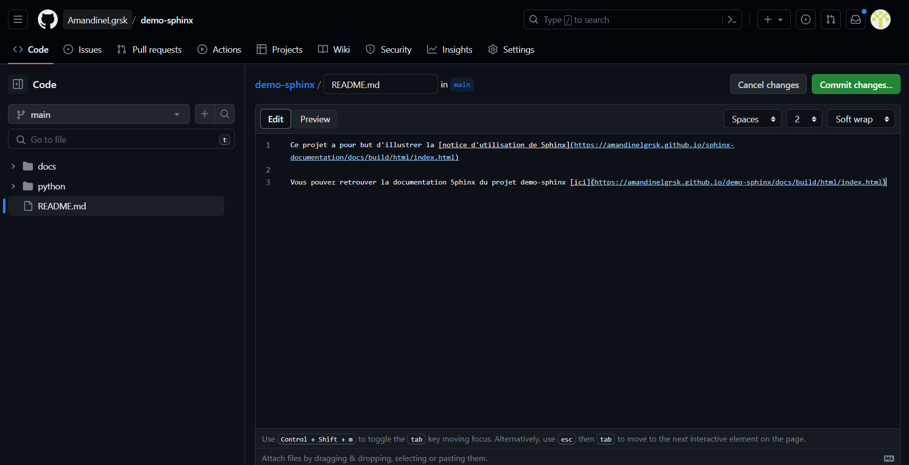
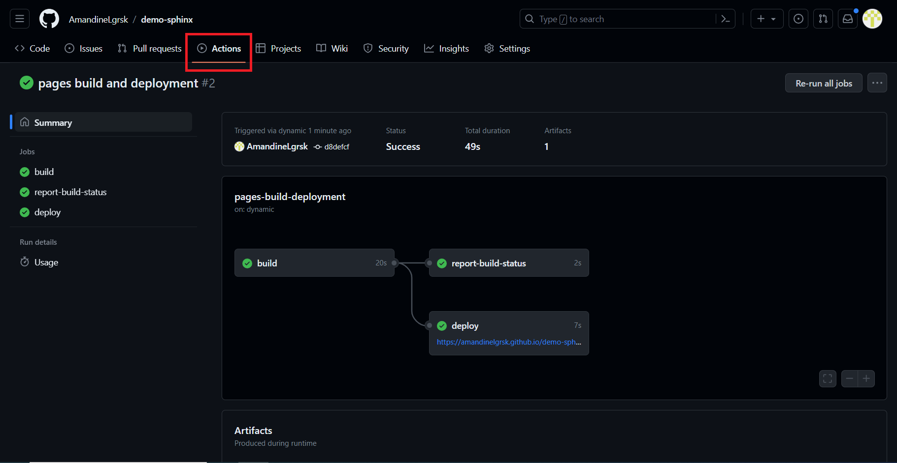

14. GitHub Pages
================

`GitHub Pages <https://pages.github.com/>`_ est un **service d'hébergement web gratuit 
fourni avec tous les dépôts 'public' hébergés sur la plateforme GitHub**. Il vous permet de publier 
la documentation de votre projet en ligne.

Pour utiliser GitHub Pages avec votre documentation générée par Sphinx, vous devez 
prendre en compte les points suivants :

Nojekyll
--------

Si votre projet ne contient pas de dossiers commençant par un underscore, vous n'aurez 
pas de problèmes particuliers. Cependant, **si vous avez des dossiers commençant par un 
underscore, vous devrez indiquer à GitHub que votre site n'est pas construit avec Jekyll**
(un générateur de sites statiques pris en charge par GitHub Pages dont la documentation 
se trouve `ici <https://docs.github.com/fr/pages/setting-up-a-github-pages-site-with-jekyll>`_ ). 
Pour cela, vous devez créer un fichier nommé ``.nojekyll`` **à la racine de votre projet**.
Comme on utilise Sphinx, il existe un plugin qui permet de générer automatiquement ce fichier. 
Pour l'activer, éditez le fichier ``conf.py`` et ajoutez la ligne suivante :

.. code-block:: python
	
	extensions = [
		'sphinx.ext.githubpages'
    ]

.. warning:: 
  
  Ce plugin ajoutera automatiquement le fichier ``.nojekyll`` au même emplacement que les fichiers ``html``. 
  Assurez-vous de déplacer ce fichier **à la racine du projet** !

Paramètres dans les settings du projet
--------------------------------------

Dans les paramètres de votre dépôt GitHub, accédez à la section ``Build and deployement`` de *pages*. 
Configurez les paramètres suivants :

* ``Source : Deploy from a branch``

* ``Branch : main et /(root)``

Ces paramètres permettent à GitHub Pages de savoir où trouver les fichiers de votre documentation 
pour les déployer correctement.

Voici la démarche à suivre :

    Sélectionner *Settings* du dépôt GitHub

    Aller dans Pages et modifier les paramètres comme indiqué ci-dessus
    

    Ajouter le lien du site web dans le ``README.md``
  

    Résultat du déploiement dans *Actions*

Résultat
--------

Une fois que vous avez effectué ces configurations, GitHub Pages générera votre site à l'adresse suivante :
**"https://<utilisateur>.github.io/<nom_projet>/docs/build/html/index.html."**
Remplacez **<utilisateur>** par votre nom d'utilisateur GitHub et **<nom_projet>** par le nom de votre projet.

Dans notre cas, la documentation est disponible en ligne à l'adresse : 
**"https://amandinelgrsk.github.io/sphinx-demo/docs/build/html/index.html"**

.. important:: 
    
    Assurez-vous de pousser vos modifications sur votre dépôt GitHub en utilisant 
    les commandes git appropriées telles que ``git add``, ``git commit`` et ``git push``, 
    pour que votre documentation mise à jour soit disponible sur GitHub Pages.
