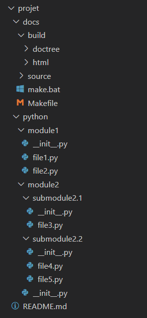

2. Structure générale d'un projet python
========================================

Je vous recommande de suivre cette **structure pour votre projet Python**, 
en créant un dossier distinct pour la **documentation** et un autre pour 
votre **code**. 

Voici une proposition de structure de projet :

    Proposition de structure générale d'un projet python

Dans cette structure :

* Le dossier *docs* contient toutes les **ressources nécessaires à la génération de la documentation**. Il est généré automatiquement à l'aide de Sphinx. Le dossier *build* contient les fichiers générés lors de la construction de la documentation.

* Le dossier *python* contient l'ensemble de votre code Python. Vous pouvez organiser votre code en utilisant des modules et des sous-modules

.. important:: 
    
    Il est important d'inclure des fichiers ``__init__.py`` dans chaque dossier pour déclarer les modules Python. 
    Cela permet d'organiser votre code en modules et facilite l'importation de vos modules dans d'autres parties du code.

* N'oubliez pas d'inclure un fichier *README.md* à la racine de votre projet pour fournir des informations supplémentaires sur votre projet.

.. caution:: 

    **Veuillez ne pas utiliser de tirets (-) dans les noms de dossier** car cela peut entraîner 
    des erreurs lors de la génération de la documentation. **Utilisez plutôt des underscores (_) 
    ou d'autres caractères valides**.
	
Cette structure de projet facilite l'organisation et la gestion de votre documentation 
et de votre code. Elle permet également d'assurer une séparation entre les deux pour maintenir 
la lisibilité de votre projet.

.. note:: N'hésitez pas à personnaliser cette structure en fonction des besoins spécifiques de votre projet.

