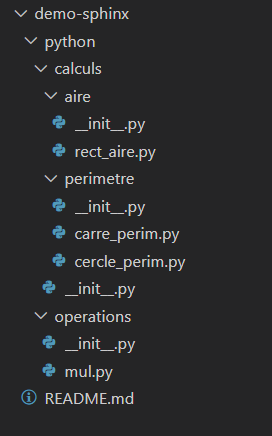

3. Démonstration
================

Pour illustrer les concepts abordés dans cette notice, on va utiliser un **projet Python intitulé** ``demo-sphinx``. 

Voici la structure actuelle du projet :

    Structure actuelle du projet demo-sphinx

Ce projet ``demo-sphinx`` est hébergé sur GitHub. Vous pouvez y accéder en suivant
ce lien : `repository GitHub demo-sphinx <https://github.com/AmandineLgrsk/demo-sphinx>`_ .

Dans ce projet, on a une structure de dossiers représentant différentes opérations mathématiques :

* Le dossier *calculs* contient deux sous-dossiers : *aire* et *périmètre*. Chaque sous-dossier contient un fichier ``__init__.py`` et des fichiers implémentant des calculs spécifiques.

    * Le sous-dossier *aire* contient un fichier ``rect_aire.py`` qui calcule l'aire d'un rectangle.

    * Le sous-dossier *périmètre* contient deux fichiers : ``carre_perim.py`` pour le calcul du périmètre d'un carré et ``cercle_perim.py`` pour le calcul du périmètre d'un cercle.

* Le dossier *operations* contient un fichier ``__init__.py`` et un fichier ``mul.py`` qui implémente une fonction de multiplication.

On utilisera ce projet ``demo-sphinx`` tout au long de cette notice pour illustrer les concepts et 
étapes nécessaires à la génération de la documentation à l'aide de Sphinx.

.. note:: 
    
    N'hésitez pas à consulter le `repository GitHub demo-sphinx <https://github.com/AmandineLgrsk/demo-sphinx>`_ pour 
    accéder au code source complet du projet.

Cette démonstration d'un projet très simple vous permettra de mettre en pratique les 
connaissances acquises et de visualiser la génération de la documentation pour un projet Python.

